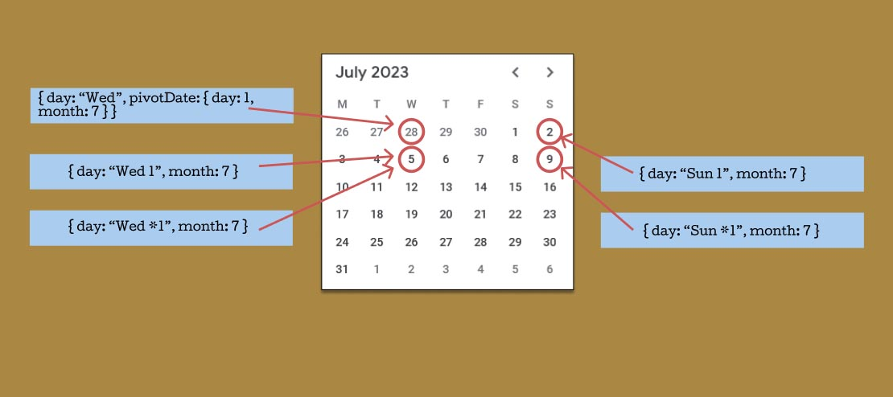

# Blue Moon Date API

Blue Moon allows you to create dates based on day name, day number, week, month, month-end and other date settings to return one specific date that matches your criteria. It can be in the past or future.

``
BlueMoon({ day: "Sunday -1", month: 5 })
``
<br>
This returns the last Sunday of May of the current year.

## Uses
Blue Moon is useful for setting dates for reports or generally finding specific dates that can be tricky to code. Finding public holidays are another use. It can be hard finding the last Wednesday of the month, Monday last week or the second Sunday of May each year.

BlueMoon is very verbose for getting specific dates for things like reports. eg 
<br>
```
const startThisMonth = BlueMoon({ day: 1 })
const endThisMonth = BlueMoon({ day: "monthend" })

const startNextMonth = BlueMoon({ day: 1, month: "+1" })
const endNextMonth = BlueMoon({ day: "monthend", month: "+1" })
```
<br>

It can be relative to the current date, a pivot date or an absolute date.

<br>

## Getting Started

Include it in your HTML file:

`<script src="https://cdn.rawgit.com/chrisjwaddell/blue-moon/main/dist/blue-moon-min.js"></script>`

Or download the file and include it in your Node project, place blue-moon.js in your directory and include:
``
const BlueMoon = require("./blue-moon")
``

To declare a start and end date that spans the start of the year to the end of the year, you can do this: \
``
const reportStart = BlueMoon( { day: 1, month: 1 })
`` \
``
const reportEnd = BlueMoon( { day: "monthend", month: 12 })
``

<br>


### Date Settings

There are four main date properties: *day*, *week*, *month* and *year*.
<br>

Each setting can be specific, relative or *current*.
<br>
relative - ``BlueMoon({ day: "+1" }) // tomorrow ``
<br>
absolute - ``BlueMoon({ day: 5, month: 3 })  // 5th of March this year  ``
<br>
current - ``BlueMoon({ day: "current", month: "+1" })   // one month from now ``

The *day* property is mandatory. The other properties are optional.


#### Day
Day can be a number such as "15", meaning the 15th of the month, it can be "+5", meaning 5 days in the future, it can be a specific dayname such as "Wednesday", it can be a dayname and week such as "Wednesday 1" or it can be "current". It can be a specific day of the month such as "Monday 2" meaning the second Monday of each month.

The *day* property is mandatory.

##### Day of the month
``
BlueMoon({ day: 5 })
``
<br>
Refers to the 5th of the current month.

``
BlueMoon({ day: 25, month: 3 })
``
<br>
Means 25th of March every year.

``
const reportMonthEnd = BlueMoon({ day: "monthend", month: 2 })
``
<br>
This calculates the end of month, whether it's 29th of February or 28th in this case, or 30th or 31st for other months.

``
BlueMoon({ day: "current", month: "+1" })
``
<br>
This calculates one month from now no matter how many days in the current month. If it's the 18th of February today, the result will be the 18th of March.


##### Day of week
Day of week can combine with a Week number or a Month.

``
BlueMoon({ day: "Mon" })
``
<br>
means Monday of the current week. *week* is default *current* so it's equivalent to ``{ day: "Mon", week: "current" }``. When it goes into the next week, it's always Monday of the current week.

``
BlueMoon({ day: "Monday", week: 2 })
`` \
means Monday of the 2nd week of each month.

##### Relative day of the week
``
BlueMoon( {day: "Thu", week: "-1" } )
``
<br>
Thursday last week

``
BlueMoon({ day: "Monday", week: "+2" })
``
<br>
means Monday in two weeks. It will always give the Monday two weeks ahead of the current week.
<br>
*Note* - You must use quotes for relative values.

``
BlueMoon({ day: "current" })
``
<br>
Today is set like this.

*"current"* can be put on *week*, *month* or *year*. *current* is a relative date type, it really means *"+0"*.
If the current date is June 30, 2022 and you have <br>
``
BlueMoon({ day: "current", month: 8 })
``
<br>
This would return <br>
``
BlueMoon({ year: 2022, month: 8, day: 30 })
``
<br>
but when the date is 1st July, 2022, it would return <br>
``
BlueMoon({ day: 1, month: 8, year: 2022 })
``
<br>


##### Relative day
For relative days, you cannot have any *week*, *month* or *year* settings.

``
BlueMoon({ day: "-90" })
``
<br>
90 days ago.

``
BlueMoon({ day: "+1" })
``
<br>
Tomorrow.

*Note* - For relative days, you must use quotes and either "+" or "-". <br>
``{ day: "+1" }`` is tomorrow but ``{ day: +1 }`` is the first day of the current month.
``{ day: 2 }`` is the same as ``{ day: "2" }``


##### Relative day of the month
There are some handy options if you are specific about full week or part week.

``
BlueMoon({ day: "Sunday 3" })
``
<br>
The third Sunday of the current month.


``
const marketDay = BlueMoon( { day: "Sunday 2", pivotDate: { day: 1, month: 1 }, loop: 24 } )
``
<br>
Market day is the second Sunday of every month.
This will find the second Sunday of every month from 1st of January this current year for the next 24 months.

``
BlueMoon({ day: "Wednesday -2", month: 10 })
``
<br>
The second last Wednesday of October of the current year.

``
BlueMoon( { day: "Monday 1", loop: 10 } )
``
<br>
The first Monday of the current month and the next 9 months

``
BlueMoon({ day: "Wedesday *1" })
``
<br>
The first Wedesday of each month that falls on a full week inside of that month. If the first Wedesday starts on the 1st or 2nd, Monday is in the previous month and so this is not considered to be a full week so _Wednesday *1_ would be the week after.

#### Week
Week works in combination with *day*. *week* can be absolute, relative or the *current* week. *week* puts you in a seven day range.
When week is an absolute number, it is the week number for the year. <br>
``
BlueMoon({ day: "Mon", week: 18 })
``
<br>
is considered to be the Monday of the 18th week of the year.

``
BlueMoon({ day: "Tuesday", week: "+2" })
``
<br>
Tuesday in two weeks from now. <br> 
``
BlueMoon({ day: "Monday", week: "current" })
`` 
<br> 
Monday of this week. <br>

``
BlueMoon({ day: "Sun", week: 2 })
`` 
<br> 
Sunday on week 2 of the year.
It counts the first week that isn't full. 1/1 of that year is the first week even if that day is in the middle of the week.


#### Month
If month is omitted, it assumed current month if other settings are specific values.

*day* and *week* work together and *day* can work with *month*.
<br>
``
BlueMoon({ day: "Tuesday", week: 2, month: 6 })
``
<br>
Tuesday in the second week of June. This specific case may be the first Tuesday in June depending on when the first week of June starts.
<br>
``
BlueMoon({ day: "Tuesday 2", month: 6 })
`` 
<br> 
This is the second Tuesday in June.
<br>
``
BlueMoon({ day: 15, month: 6, year: 2023 })
`` 
<br> 
The 15th of June, 2023.

So we have four main options:
\<dayname\> \<occurrence number\> - Picks the day from the month. It counts the first day occurrence regardless of whether or not the first week overlapped into the previous week. eg 
``
BlueMoon({ day: "Fri 2" })
``
<br>
\<dayname\> -\<occurrence number\> - Picks the day that occurred in the month, the **last** being -1.  eg ``BlueMoon({ day: "Sat -1" })`` <br>
\<dayname\> *\<occurrence number\> - Picks the day from only **full weeks**. eg ``BlueMoon({ day: "Fri *2" })`` <br>
\<dayname\> *-\<occurrence number\> - **Full week**, from the **last** week of the month. eg ``BlueMoon({ day: "Sun *-2" }) `` <br>

*Note* - There is also: <br>
\<dayname\> \<week\>
<br>
The difference with this is that if you enter <br>
``
BlueMoon({ day: "Monday", week: 1 })
``
<br>
Week 1 is the first of that month, and the start of the week probably is in the previous month. In this case, Monday would be the date of the previous month, something like 29th of the previous month. Using the *month* setting, you only get days in that month.


The picture above shows that *Wed 1* and *Sun 1* give you the first day within the month and _Wed *1_ and _Sun *1_ gives the day of the first full week of that month. 


#### Year
Year must be either a four digit specific year eg *2024*, a relative number *+1* or *current*.

##### Specific year
``
BlueMoon({ day: 1, year: "2023" })
`` <br>
This returns the first of the current month in 2023 every time it's run.

### Relative year
``
BlueMoon({ day: 1, year: "+1" })
`` <br>
This returns the first of the current month of next year every time it's run. <br>
*Note* - You must use quotes for relative values.

##### Current
*current* is like a relative year, like *+0*. *day*, *week*, *month* or *year* can be set as *current*.

``
BlueMoon({ day: "current", month: 1 })
`` <br>
If the date is 15th of March, 2024, this would return 
``
BlueMoon({ day: 15, month: 3, year: 2024 })
``
<br>


If you leave out *month* or *year*, it defaults to *current*.<br>
``
BlueMoon({ day: 1 })
``
<br>
is the same as <br>
``
BlueMoon({ day: 1, month: "current", year: "current" })
``
<br>
This returns the first of the current month you are in, every time you run it, it will return the first of that month of the current year you are in.

``
BlueMoon({ day: "Monday" })
``
<br>
This returns Monday of the current week. Day of the week is used in conjuction with *week*, if *week* is missing, it assumes 
``week: current``


For *day*, if you set it as relative eg
``
BlueMoon({ day: "+14" })
``
<br>
You cannot have any *week*, *month* or *year* settings. This wouldn't make sense. Relative day is a particular number of days ahead or behind today.

You can mix and match if day is not relative, such as <br>
``
BlueMoon({ day: "current", month: "+1", year: "current"})
``
<br>
``
BlueMoon({ day: "Monday", week: 2, year: "current"})
``
<br>
``
BlueMoon({ day: 15, month: "+1", year: "current"})
``


<br>

### Options

There are four options:
<br>
* pivotDate - the date you start from
* loop - you can loop forward or backwards, Blue Moon will return an array of dates in either the past or future
* resultAsDateObject - Default is false. Setting *resultAsDateObject* to true will return a Javascript date type.
* startOfWeek - the default is Monday.
* warnings - warnings in the console. It warns you when you are at a date over 28 and want to increase the date by one month and the next month may not have as many days in that month.


#### Pivot date
This is the date you want to start from. Like a reference point. You could find the first Sunday in March starting from 2000.
Pivot date is the second argument.
The default is today if pivot date is empty.
It must be an object that represents a specific date with *day*, *month* and *year* properties.
You could set the pivot date as:
<br>
``
BlueMoon({ day: "Sunday 1", month: 3, pivotDate: { day: 1, month: 1, year: 2000 } } )
``
<br>
This finds the first Sunday in March 2000. Without pivot date, and with *year* omitted, it assumed ``year: "current"`` to return the first Sunday in March for this year.
<br>
``
BlueMoon({ day: "Sunday 1", month: 3 })
``
<br>
This finds the first Sunday in March this year.


#### loop
This can be a useful feature returning an array of dates.
It can move backwards and forwards in time to get past or future dates. 

``
BlueMoon({ day: "Mon 1", pivotDate: {day: 1, month: 1}, loop: 12})
``
<br>
Blue Moon returns an array of twelve dates, the first Monday of each month this year.


``
const next5MothersDays = BlueMoon({ day: "Sunday 2", month: 5, loop: 5})
``
<br>
Returns an array of dates of Mothers days for the next five years.

Blue Moon categorizes the frequency based on the type of *day* value. The date can change daily, weekly or yearly.

Daily
<br>
``
BlueMoon({ day: "current", loop: 10 })
``
<br>
This would return the next 10 days
``


Weekly
<br>
``
BlueMoon( { day: "Mon", loop: 5 })
``
<br>
The would return an array of 5 values with Monday this current week and the next 4 Mondays.


Monthly
<br>
``
BlueMoon( { day: 1, loop: 5 })
``
<br>
This returns the first of the current month and the first of the next four months. <br>
``
BlueMoon( { day: "monthend", loop: -5 })
``
<br>
Returns the month end of this month and the last four months.
<br>
``
BlueMoon( { day: "Sunday 3", loop: 2 })
``
<br>
Returns the 3rd Sunday of this month and the 3rd Sunday of the next two months.


Yearly
<br>
``
BlueMoon( { day: "Mon", week: 15, loop: 2 })
``
<br>
Returns Monday of the 15th week of this year, and same for next year.
<br>
``
BlueMoon( { day: 10, month: 4, loop: 2 })
``
<br>
Returns 10th of April of this year and next year.
<br>
``
BlueMoon( { day: "Sunday 3", month: 4, loop: 2 })
``
<br>
Returns 3rd Sunday of April of this year and next year.


#### resultAsDateObject
The default is to return a Blue Moon date object (which is an object with *day*, *month* and *year*). You can opt to return a Javascript Date.
*Note* - If you return a Javascript date, it returns the date at the start of the day midnight ie 00:00:00 in your local time zone.

``
const intIndependenceDay = BlueMoon( { day: 4, month: 7, resultAsDateObject: true, loop: 5 })
``
<br>
This gives you the next five Independence Days as a javascript date.


#### startOfWeek
To specify when the start of the week is. The default is 1 - Monday. Sunday is 0.

``
BlueMoon({ day: "Mon 1", startOfWeek: 0 })
``
<br>
Returns the first Monday of the month. The first week is the week that starts at Sunday.


#### warnings
Turn off warnings in the console. The default is true. 

``
BlueMoon({ day: 31 })
``
<br>
You will get a warning with this setting because next month may return an incorrect date because it may not have 31 days in the month.

``
BlueMoon({ day: 31, warnings: false })
``
<br>
However, this won't give a warning.


